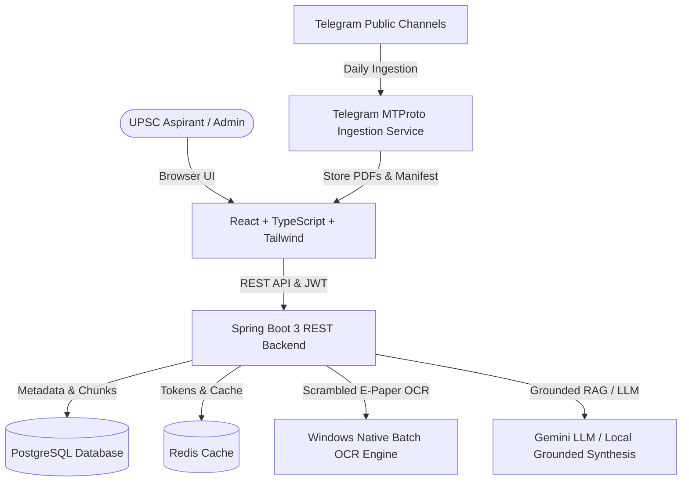

# UPSC NewsHub AI — Smart Current Affairs & Research Platform

<p align="center">
  <strong>An Intelligent, Document-Grounded UPSC CSE Preparation & Newspaper Research OS</strong>
</p>

<p align="center">
  
  
  
  
  
</p>

---

## 📖 Overview

**UPSC NewsHub AI** is an advanced full-stack current affairs and research platform built specifically for UPSC Civil Services Examination (CSE) aspirants. It automates daily e-paper ingestion, extracts text from scrambled/image-based newspapers via hardware-accelerated batch OCR, and provides **document-grounded AI RAG analysis** with exact page citations.

---

## ✨ Key Features

### 1. 📄 Document Intelligence & Grounded UPSC RAG
* **Instant Upload & Background Indexing:** Upload PDF study material or e-papers up to 50 MB with immediate UI feedback and background indexing.
* **Hardware-Accelerated Batch OCR:** Processes 20+ page e-papers with custom/scrambled fonts in **~4–5 seconds** using parallel rendering and Windows native `OcrEngine`.
* **Zero-Hallucination Grounding:** RAG Q&A answers queries strictly using verified document facts and cites exact page numbers.
* **1-Click Topic Extractors:** Instant categorization for **Defence & Security**, **Geopolitics & IR**, **Polity & Governance**, **Economy**, **Environment**, and **Science & Tech**.
* **UPSC Exam Utilities:** 1-click generators for **5 Practice Prelims MCQs**, **200-Word Mains Model Answers**, and **Syllabus Mapping (GS-I to GS-IV)**.

### 2. 📰 Automated Telegram Newspaper Ingestion
* **Live Ingestion Daemon:** Scans public Telegram channels for daily morning newspaper PDFs (Indian Express, The Hindu, Dainik Jagran, etc.).
* **Automated Daily Scheduler:** Runs via cron jobs (default 6:30 AM IST) and maintains an indexed JSON archive manifest.

### 3. 🔐 Enterprise Authentication & Role Management
* **JWT Authentication:** Access & Refresh token rotation with secure BCrypt password hashing.
* **Dual Roles:** `ASPIRANT` (standard user access) and `ADMIN` (system diagnostics, user management, and manual ingestion triggers).

---

## 🏗️ Architecture



---

## 🛠️ Technology Stack

| Layer | Technologies |
|---|---|
| **Frontend** | React 18, TypeScript, Vite, Tailwind CSS, Lucide Icons, Zustand, Axios |
| **Backend** | Java 17+, Spring Boot 3.3.3, Spring Security (JWT), Spring Data JPA, Apache PDFBox |
| **OCR Engine** | Windows Runtime WinRT `[Windows.Media.Ocr.OcrEngine]`, PowerShell 5.1+ |
| **Database** | PostgreSQL 16+, Flyway DB Migrations |
| **Cache / Queue** | Redis 7+ |
| **Telegram Ingestion** | Node.js (v18+), Telegram MTProto API |
| **AI / RAG** | Document Chunking (400 words / 50 overlap), TF-IDF / Keyword Scoring, Gemini 1.5 Flash |

---

## 🚀 Getting Started

### Prerequisites
* **Java 17 or 21** installed (`java -version`)
* **Maven 3.8+** installed (`mvn -version`)
* **Node.js 18+** & `npm` installed (`node -v`)
* **PostgreSQL 16+** running on `localhost:5432`
* **Redis** (optional, runs embedded or on `localhost:6379`)
* **Windows 10/11** (for native hardware-accelerated WinRT OCR)

---

### 1. Clone Repository & Setup Environment

```bash
git clone https://github.com/Aditya2kk/upschelper.git
cd upsc-helper
```

Create your local `.env` file from the template:
```bash
cp .env.example .env
```

---

### 2. Database Setup

Create a PostgreSQL database named `upscnewshub`:
```sql
CREATE DATABASE upscnewshub;
```

---

### 3. Start the Spring Boot Backend

```bash
cd backend
mvn spring-boot:run
```
*Backend starts on `http://localhost:8080` (Flyway automatically runs migrations).*

---

### 4. Start the Frontend

```bash
cd frontend
npm install
npm run dev
```
*Frontend opens at `http://localhost:5173`.*

---

### 5. (Optional) Run Telegram Newspaper Fetcher

```bash
cd telegram-service
cp .env.example .env
# Fill in your TELEGRAM_API_ID and TELEGRAM_API_HASH in .env
npm install
npm run fetch
```

---

## 🔒 Security & Environment Variables

| Variable | Description | Default |
|---|---|---|
| `DATABASE_URL` | PostgreSQL JDBC Connection URL | `jdbc:postgresql://localhost:5432/upscnewshub` |
| `DATABASE_USERNAME` | PostgreSQL Username | `postgres` |
| `DATABASE_PASSWORD` | PostgreSQL Password | `postgres` |
| `JWT_SECRET` | 256-bit secret key for JWT signing | *(Set a strong random key in production)* |
| `ADMIN_SECRET` | Secret key required to register an Admin account | `UPSC_ADMIN_2026` |
| `GEMINI_API_KEY` | (Optional) Google Gemini API Key for LLM RAG synthesis | *(Falls back to local synthesis if unset)* |

---

## 📁 Repository Structure

```
upsc-helper/
├── backend/                  # Spring Boot 3 Java Backend
│   ├── src/main/java/        # Controllers, Services, Entities, Repositories, Security
│   └── src/main/resources/   # application.yml, Flyway migrations (V1, V2, V3)
├── frontend/                 # React 18 + TypeScript + Vite SPA
│   ├── src/pages/            # MyDocuments, AiResearch, NewspaperLibrary, NewsFeed, Admin
│   ├── src/components/       # TopNav, Sidebar, Common Components
│   └── public/newspapers/    # Newspaper archive & manifest
├── telegram-service/         # Node.js MTProto newspaper ingestion daemon
├── scripts/                  # Batch OCR WinRT engine, Admin provisioning scripts
├── .env.example              # Environment variables template
└── .gitignore                # Production git exclusion rules
```

---

## 📜 License
This project is for educational and UPSC preparation research purposes.
Distributed under the MIT License.
